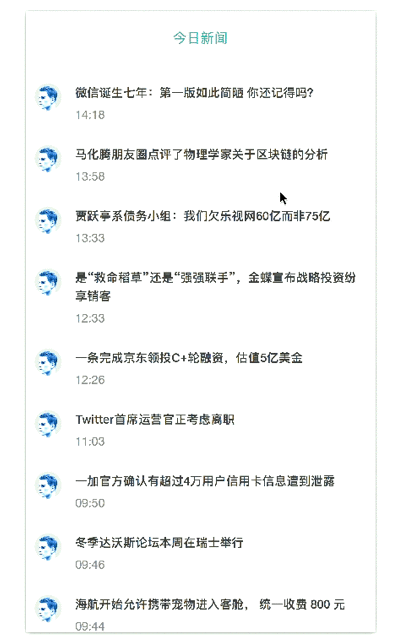

# React-News

<div align="center"></div>

## 概览

通过 node.js 创建的一个爬虫小实例，前端通过 react 渲染

## 使用

1.下载或者 clone 本项目

2.安装依赖:

```
$ npm install
```

3.启动项目:

```
$ npm run start
```

开启后，打开 localhost:9000

## 脚手架

[入门教程]（https://github.com/simplefeel/react-node-learn)</br>
